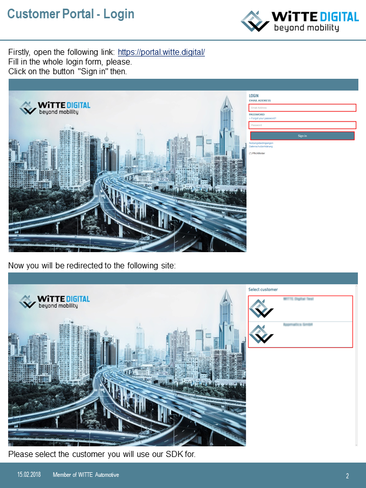
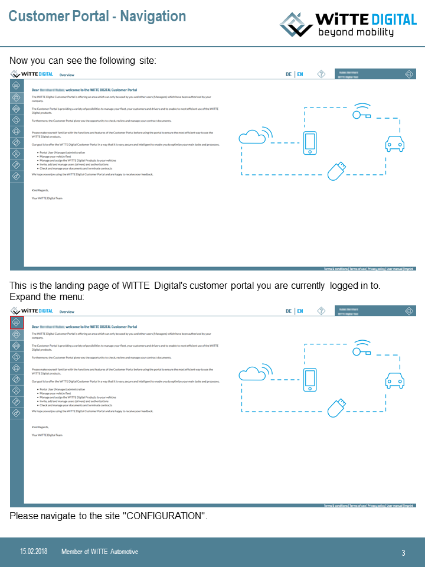
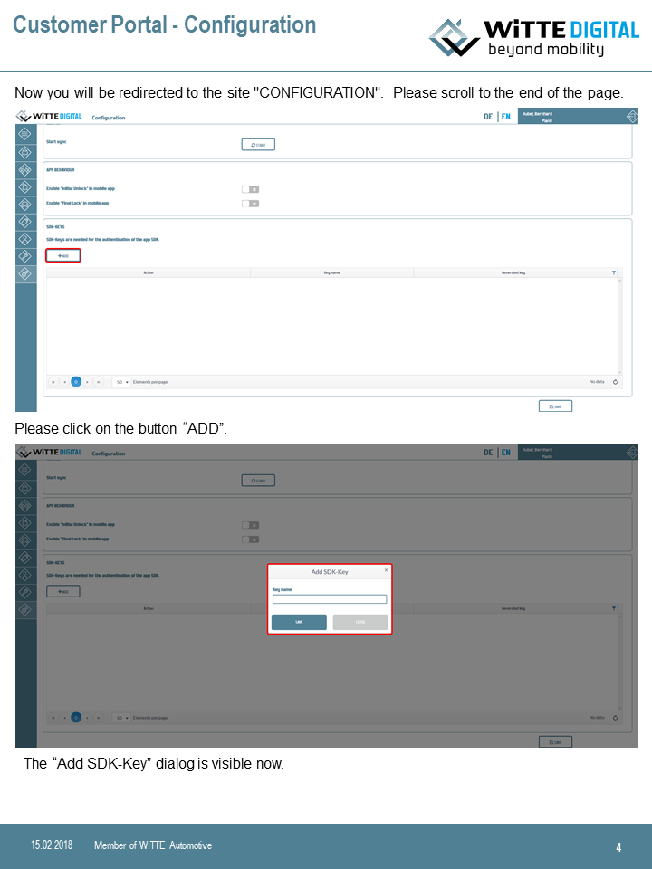
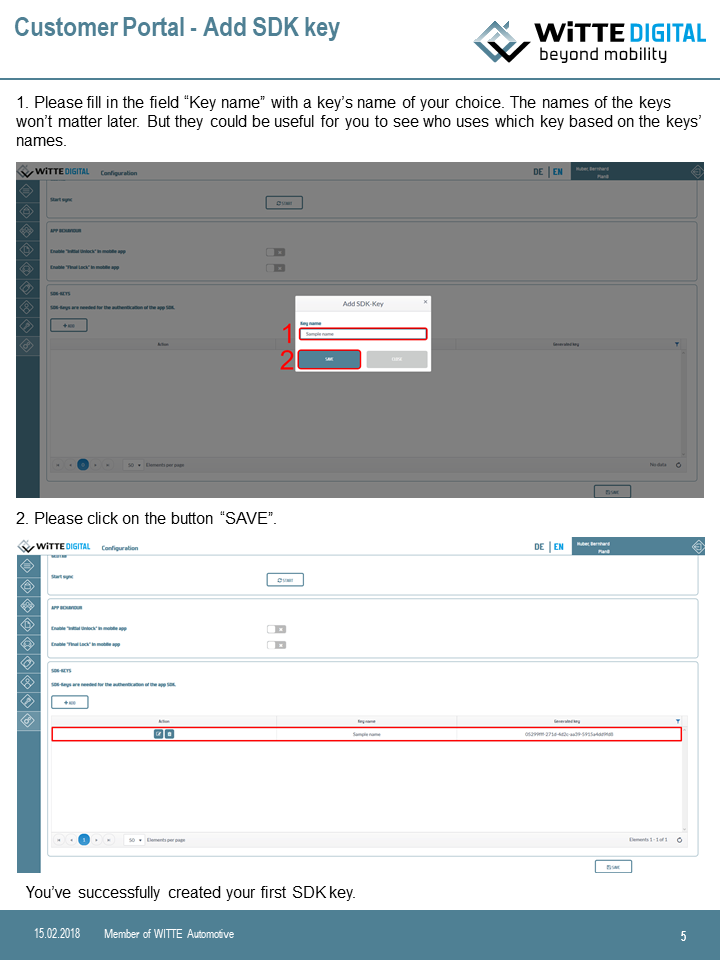

# Tapkey App SDK and WITTE SDK Integration Guide

NOTE: Please send an e-mail to contact@witte.digital if you wanna get access to the Tapkey SDK source code files. 

Tapkey App SDK allows Android and iOS apps to communicate with Tapkey-enabled locking devices. This SDK bundle contains the Tapkey SDK libraries for Android and iOS, a sample app for Android and iOS respectively that demonstrates how to communicate with the WITTE SDK and Tapkey APP SDK as well as this integration guide.

The sample app is a runnable app that demonstrates the required core functionality for being able to access Tapkey-enabled locking devices. It provides sample code which can be used and amended by the users of the SDK.

This guide explains how to integrate the Tapkey SDK and the WITTE SDK into an Android or iOS app in order to access Tapkey-enabled locking devices distributed by WITTE. Accessing locking devices is controlled by the Tapkey SDK such that only permitted users can receive access keys and they can access the devices only at the permitted time frames. This guide assumes basic knowledge about how to use the WITTE SDK in order to register users, cars and locking devices at the WITTE back-end and assigning locking devices to cars as well as assigning users to cars.

_Note:_ The Tapkey APP SDK and WITTE SDK is delivered in two folders: The folder _Tapkey App SDK_ contains the original Tapkey App SDK delivered by Tapkey GmbH. The folder _WITTE SDK Integration_ contains a sample app for Android and iOS respectively that illustrates how to integrate the WITTE SDK into the Tapkey App SDK in order to enable users to access Tapkey-enabled locking devices distributed by WITTE.

The overall workflow for accessing locking devices as a user of the app is as follows:

*   Initialize the app with the necessary parameters.
*   Check if the current app version is up-to-date and let the user install a newer version if some crucial update to the Tapkey APP SDK or WITTE SDK has been released.
*   Provide your own logic to check whether a user of yours is already signed to the app.
*   If a user is not signed in, provide your own logic to authenticate a user against your back-end.
*   If a user of yours is signed to the app, obtain its WITTE identifier by using the WITTE SDK.
*   Obtain an authentication token via the WITTE SDK using the obtained user identifier.
*   The user must be authenticated against the Tapkey service with that token. This enables the user to receive the required access keys to access their granted locking devices.
*   Let the user select a car assigned to them in your back-end.
*   Obtain whether this car has a locking device assigned and if so, obtain its service identifier via the WITTE SDK.
*   Use this service identifier to obtain the lock identifier of this locking device (e.g. C1-08-F0-94) via the WITTE SDK.
*   Invoke the trigger function to open or close the desired locking device using its lock identifier.

_Note:_ In order to access the WITTE SDK, you need a subscription. The corresponding subscription key must be passed to the WITTE SDK functions in the app. Please keep the subscription key confidential in your app.

### App SDK File Structure

The App SDK is provided as archive with following directory structure:

*   *./*
*   *./Android/*
*   *./Android/Libs/* - The files and libraries to be referenced by the consuming Android app.
*   *./Android/Tapkey.SdkSample/* - Android sample app
*   *./iOS/*
*   *./iOS/Libs/* - The files and libraries to be referenced by the consuming iOS app.
*   *./iOS/Tapkey.SdkSample/* - iOS sample app

## Integration - Android

### App SDK File Structure

The Android App SDK is provided with following directory structure:

*   *./Android/*
*   *./Android/Libs/* - a maven repository including the Tapkey App libraries
*   *./Android/Tapkey.SdkSample/* - the Android sample app

### Configuring Push Notifications

Tapkey uses Google Cloud Messaging to send push notification to Android Clients. This section describes the steps to enable push notifications in the Android app.

#### GCM Sender Id

For registering clients in Android, the _GDM Sender ID_ is required. For all users of the App SDK, the push notifications are handled by the same Google project. Please use the sender ID exposed in the sample app. The GCM sender ID will be used in Android applications when creating the _TapkeyServiceFactoryBuilder_ instance, as outlined in the _Android_ chapter).

### Building the Sample App

The sample app is built using a Gradle Build Script. It can easily be opened in the Android Studio IDE by using the Gradle import functionality.

To build the sample app, open a command prompt in the _/Android/Tapkey.SdkSample_ folder and run the `gradlew build` command or Select Build - Rebuild Project from the top menu of the Android Studio IDE.

### Integrating the Tapkey App libs

To integrate Tapkey functionality into your application, reference the Maven repo provided as part of the Tapkey App SDK and follow the procedure outlined in the sample application.

The following is an incomplete snippet of a build.gradle file, containing the most relvant settings.
```gradle
repositories {
    /*
    * Add local tapkey-sdk maven repository to repositories
    */
    maven { url "../../Libs" }
}
android {
    compileSdkVersion 27
    buildToolsVersion "25.0.3"
    defaultConfig {
        minSdkVersion 19
        targetSdkVersion 27
    }
    buildTypes {
        release {
            minifyEnabled true
            proguardFiles getDefaultProguardFile('proguard-android.txt'), 'proguard-rules.pro'
        }
    }
}

dependencies {
    /*
    * Add Tapkey.MobileLib to dependencies
    */
    compile 'net.tpky:Tapkey.MobileLib:1.5.3.6'
}
```
Tapkey requires following settings:

*   Android minSdkVersion >= 19
*   Proguard obfuscation enabled

### Proguard

Tapkey requires apps to be obfuscated for publishing. To enforce obfuscation, Tapkey issues a warning Toast message on app startup, if an application is built in release mode and not obfuscated. A proguard configuration file named _proguard-android.txt_ is contained in the Tapkey.MobileLib AAR.

### Major Integration Steps

*   Reference the Tapkey.MobileLib Android archive from the Maven repo provided with the SDK.
*   Let the Application class implement TapkeyAppContext
*   Typically in the Application.onCreate method, create an instance of TapkeyServiceFactory by using the TapkeyServiceFactoryBuilder class. As parameter the _GCM sender ID_ is required.
*   Change the default cookie manager as done in the sample app’s App.onCreate method
*   Register the PushNotificationReceiver as done in the sample app’s App.onCreate method
*   When presenting the activity that offers the unlock experience to the user
    *   Request permission “Coarse location”
    *   Register listeners to be notified when keys are updated or Bluetooth locks nearby change.
    *   Start scanning for BLE devices using the bleLockManager.startForegroundScan() method.
    *   Make sure to unregister the listeners and stopping scanning when leaving the activity.
*   When locks come into range that the user has a matching key for, offer lock access functionality (e.g. via a button).

## Integration - iOS

### App SDK File Structure

The iOS App SDK is provided with a directory structure as follows:

*   iOS/*
*   iOS/Libs/* - The files and libraries to be referenced by the consuming app.
*   iOS/Libs/Headers/* - Library header files. Add this folder to the consuming app's include search path.
*   iOS/Libs/TapkeyMobileLibSource/* - Required additional source files. Reference and build these files with the consuming iOS app.
*   iOS/Libs/TapkeyMobileLib.framework - The Tapkey core libraries, provided as dynamic framework. Linked and embed this framework in the consuming app.
*   iOS/Libs/PodDependencies - A Ruby file describing the cocoa pods required for the integration. Load and invoke this file from the consuming app's podfile.
*   iOS/Tapkey.SdkSample/* - The very basic sample app that is provided to demonstrate how to use the App SDK.

### Configuring Push Notifications

Tapkey uses Google Cloud Messaging to send push notification to Android and iOS Clients. This section describes the steps to enable push notifications in the iOS app.

#### Configure Google to use APN for iOS

For make push notifications work in iOS, APN and GCM must be configured as lined out in the following:

##### Configure APN in Apple Member Center

Follow the steps outlined at [https://developers.google.com/cloud-messaging/ios/certs](https://developers.google.com/cloud-messaging/ios/certs) to obtain an APN certificate. Basically, the guide at this link includes the following steps:

*   Generate a certificate signing request using Keychain Access on your Mac.
*   Create an App ID if not done so before.
*   Enable push notifications at your App ID.
*   Configure the App ID for push notifications by creating SSL certificates for development and distribution.
*   Create a provisioning profile if not done so before and add the before-mentioned App ID.

##### Upload the APN Certificates to the GCM Google Project

*   Open link: [https://developers.google.com/mobile/add?platform=ios](https://developers.google.com/mobile/add?platform=ios)
*   Create an iOS App
    *   Select created Google Project
    *   Enter iOS Bundle Id
    *   Click on _Choose and configure services_
*   Enable Cloud Messaging
    *   Select _Cloud Messaging_
    *   Upload Certificates
    *   Enable Cloud Messaging
    *   Generate configuration File
    *   Download GoogleServices-Info.plist

The obtained _GoogleService-Info.plist_ file will be used in the iOS app as outlined in the iOS integration chapter. During the process of generating the GoogleService-Info.plist, an API key is generated. Copy this API key and send it to Tapkey such that Tapkey is able to send push notifications on the context of the created app account.

_Note:_ When sending the API key to Tapkey, make sure to use a secure transport in order to keep the key confidential.

### Building the Sample App

The sample app is provided as Xcode workspace and can be opened with Xcode 8.2.1\. Note that the Tapkey libraries are Swift 3.0.2 libraries (Xcode 8.2.1) and cannot be imported in applications that are developed with different versions of Xcode by default. When opening the workspace, make sure to open the `*.xcworkspace` file rather than the `*.xcodeproj` file!

Before the app can be built, the cocoapod dependencies must be installed. For that run `pod install` from the commandline in workspace folder.

Because of app signing and APN authentication requirements of Apple, the app must be reconfigured accordingly in order to run as expected.

### Integrating the Tapkey App libraries

#### Configuring Push Notification

Receiving push notifications is required for the Tapkey App SDK components to work properly. The following steps are therefore crucial.

*   Make sure that APN has been configured for your App ID that is added to your provisioning profile and the certificates are uploaded to the Google developer console.
*   Add GoogleService-Info.plist to the consuming app's iOS Project.
*   Enable "Push Notifications" in your app's capabilities.
*   Enable "Remote Notifications" and "Background fetch" in Section "Background Modes" in App Capabilities.
*   Make sure that "APS Environment" was added in the App entitlements. The value must be "development" when developing the iOS app and "production" when distributing the app.

#### Install Dependencies

*   Make sure, cocapod is installed.
*   Create and configure a Podfile according to your needs (see [cocoapods.org](https://cocoapods.org/).
*   Configure your Podfile to install required Tapkey dependencies.
    *   Load the PodDependencies file from Lib folder.
    *   call `tk_mobile_lib_pods` in app target.
*   run `pod install` from commandline.

Example Podfile:
```ruby
...
load '../Libs/PodDependencies'  
target 'App' do

    [your dependencies]

    tk_mobile_lib_pods
end
...
```
#### Configure Project Settings

*   Link and embedd TapkeyMobileLib.framework into your app.
*   Add the */Libs folder to the framework searchpath.
*   Add the */Libs/Headers folder to the header search path.
*   Add all files in folder */Libs/TapkeyMobileLibSource to the project.
*   Add the GoogleService-Info.plist
*   Disable bit code, as this is not supported yet.

#### Bootstrap the Tapkey libraries

##### AppDelegate

*   Import the `TapkeyMobileLib` module.
*   Implement the `TapkeyAppDelegate` protocol.
*   Create and register an instance of TapkeyServiceFactory in the `willFinishLaunchingWithOptions` callback

The sample app outlines how to integrate and bootstrap the Tapkey libraries.

### Known limitations

*   The framework does not include a binary for Simulator.
*   The framework does not include bitcode.

## Concepts

### Lock IDs

In the Tapkey Lock Control Protocol (TLCP), locking devices are identified by the TLCP lock ID, which is a byte array of dynamic length (in the context of this SDK sometimes called the 'physicalLockId'). The ID has the following format (each character represents one byte):

    LLXXXX

*   LL: The length of the actual ID (the XXXX part), encoded in 2 bytes, little endian.
*   XXXX: The actual ID

The following ID of six bytes length has two bytes length header and four bytes ID payload:

    04001234BFFB

Throughout the Tapkey ecosystem the TLCP lock ID is represented in various formats.

*   Pretty format: To the customer the ID is always presented in pretty format, that is, HEX formatted without length header, bytes separated with dashes, e.g. `12-34-bf-fb`.
*   As byte array: Throughout the TLCP protocol, IDs are simply handled as byte arrays.
*   Base64 in Json: On the Tapkey Management REST API IDs are encoded as regular BASE64 strings when contained in JSON entities (e.g. `EjS/+w==`).
*   Base64 in URLs: On the Tapkey Management REST API IDs are encoded as URL-safe BASE64 strings when contained in request URLs (e.g. `EjS_-w`) (see RFC 3548 section 4; i.e. '+' and '/' are replaced by '-' and '_' and trailing '=' are ommitted).

### Customization

The App SDK comes with default settings to connect to the official Tapkey Trust Service instance but can be customized to connect to different instances as required. Customization is done via the TapkeyServiceFactoryBuilder, e.g.
```swift
/*
* Create an instance of TapkeyServiceFactory. Tapkey expects that a single instance of
* TapkeyServiceFactory exists inside an application that can be retrieved via the
* Application instance's getTapkeyServiceFactory() method.
*/
TapkeyServiceFactoryBuilder b = new TapkeyServiceFactoryBuilder()

    /*
    * Optionally, settings like the backend URI and tenant ID can be changed.
    */
    // Change the backend URI if required.
    .setServiceBaseUri("https://example.com")

    // Change the SSLContext if required to implement certificate pinning, etc.
    .setSSLContext(SSLContext.getDefault());

/*
* Build the TapkeyServiceFactory instance.
*/
TapkeyServiceFactory tapkeyServiceFactory = b.build(this);
```
### Authentication

In Tapkey authentication is based on OpenID Connect. To authenticate against the Tapkey Trust Service, a valid OpenID Connect ID token is required. For accessing Tapkey-enabled locking devices distributed by WITTE, all those locking devices as well as the user identities at the Tapkey back-end live in the WMA tenant of the Tapkey back-end. The authentication is performed by sending an OAuth token to the Tapkey server as exposed in the sample app:

*   Make sure, the identity provider for the WMA tenant is implemented in the consuming app. Create an implementation of the `IdentityProvider` interface for the given identity provider and register it with the instance of IdentityProviderRegistration available via the TapkeyServiceFactory. Implement the following functions:
    *   `refreshToken()`: Called by the Tapkey SDK if an ID token expired. The implementor should try to refresh the token and return an updated ID token.
    *   `logOutAsync()`: Called by the Tapkey SDK if a user should be logged off. This happens e.g. if an expired ID token cannot be refreshed.
*   Let the user authenticate against Tapkey using the authentication token. Invoke `UserManager.authenticateAsync(...)` and pass the ID token to authenticate the user against the Tapkey Backend Services.

See the Sample application provided with the App SDK for an example of how to use the TapkeyIdentityProvider.

#### Create SDK key









#### How to use a SDK key

You need to provide one of your created SDK keys for each request you send to our App SDK API interface. The detailed documentation of this API interface could be found at: [Developer Portal of the WITTE Digital APIs](https://wittedigitalapimprod.portal.azure-api.net/).

### Custom Lock Response Data

When executing an lock/unlock command, some locks return custom extra data, supplementing the basic success response. If required, the mobile app can retrieve and use this data. The `CommandExecutionFacade.triggerLockAsync` function returns an instance of `CommandResult`. The custom data is represented as `byte[]` and is contained in the `responseData` field.

_Note:_ The data structures returned in the `CommandResult.responsData` field are defined by the respective lock manufacturer and not standardized by Tapkey. When evaluating the data, the according lock type or at least the lock manufacturer MUST be considered to avoid misinterpretation.

## Firmware Upgrade

Tapkey provides functionality for upgrading the firmware of Tapkey-enabled locking devices. The process roughly consists of following steps:

*   Query the lock's state by using the `CommandExecutionFacade.queryPublicStateAsync` function. The returned data structure contains information required to query information about available firmware from the server.
*   Query information about firmware packages available for installation from the WITTE server. The required parameters `manufacturerId`, `fwType` and `compatibleFromVersion` can be taken from the public state from the previous step.
*   Optionally present the available firmware versions to the user and let the user select the package to install.
*   Use the `FirmwareManager.downloadFirmwareContentAsync`function to download the encrypted firmware package for the respective locking device.
*   Upload and install the package to the locking device using the `CommandExecutionFacade.upgradeFirmware` function. If starting from scratch, provide 0 as `firstChunkIdx` argument. If continuing an upload, provide the last value returned by the `progress` callback's `getNofChunksCompleted()` parameter.

_Note:_ The user installing the firmware upgrade package must have an unlock permission for the upgrade process to succeed.

## Other Things to consider

*   Verify internet connectivity: The App SDK maintains an offline cache of access keys to allow offline access. However, in order to receive keys and other kinds of data, internet access is required. It's therefore suggested to issue a warning to the user in an appropriate place, in case of missing internet connectivity.
*   Verify Bluetooth: The App communicates with locks via Bluetooth. We therefore suggest to issue a warning to the user in case Bluetooth isn't available for any reason.
*   Android: Verify that Google Play Services are installed: The App SDK relies on the Google Play Services, particularly for sending push notifications. When the app is started, verify the Google Play Services are installed and implement appropriate error handling if not. See the sample app provided with the App SDK for an example on how to implement the verification.

## Legal

The App SDK is provided under a proprietary commercial license. It must not be used or redistributed, except with written consent of Tapkey. The App SDK must not be used other than intended and permitted by Tapkey. This implies that the App SDK may be used only to communicate with Tapkey-enabled devices under the ISO 7816 Application IDs, Bluetooth Service IDs, etc. as permitted by Tapkey by written consent.
